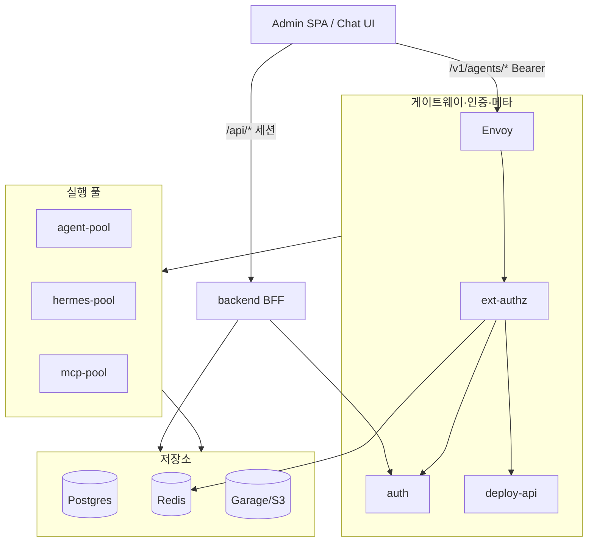

# agents-runtime 개발 가이드

새로 합류하는 개발자를 위한 문서입니다. **무엇을 만드는 프로젝트인지**, **코드가 어떻게 나뉘어 있는지**, **런타임이 어떻게 동작하는지**, **이 저장소만의 기술적 특이점**을 중심으로 정리했습니다.

계약·스키마의 정본은 [ARCHITECTURE.md](../ARCHITECTURE.md), 컴포넌트 내부 설계는 각 `DESIGN.md`, 작업 방법은 [AGENTS.md](../AGENTS.md)를 참고하세요.

---

## 1. 프로젝트 한 줄 요약

**agents-runtime**은 Kubernetes 위에서 **LLM 에이전트**와 **MCP 서버**를 운영하는 런타임 플랫폼입니다.

- **베이스 이미지**는 장기 실행 Pod로 띄우고, **사용자 코드**(agent graph, MCP tool)는 invoke 시점에 **동적으로 배포**합니다. (AWS Lambda와 유사)
- **관리 콘솔**(React SPA + FastAPI BFF)이 같은 저장소에 포함되어, 번들 등록·사용자·권한·채팅 UI를 제공합니다.
- **범위 밖**: LLM 서빙(vLLM 등), RAG 스토리지, OTEL 수집기, 별도 Chat UI. (단, path-graph 파이프라인 연동은 BFF·VFS로 포함)

---

## 2. 저장소 구조

```
agents-runtime/
├── backend/          # Admin BFF — source_meta/user_meta/users 쓰기 소유자
├── frontend/         # Admin SPA + Chat UI (Vite + React)
├── services/
│   ├── auth/         # 로그인·JWT 검증·access[]
│   ├── deploy-api/   # /v1/resolve — 런타임 메타 read-only
│   └── ext-authz/    # Envoy ext_authz — 인가·스케줄링·x-pod-addr
├── runtimes/
│   ├── agent-base/   # Agent pool (LangGraph, ADK)
│   ├── hermes-base/  # Hermes profile pool
│   └── mcp-base/     # MCP pool (FastMCP, MCP SDK)
├── packages/common/  # runtime_common.* — 공용 스키마·로더·스케줄링
├── deploy/k8s/       # Kustomize (namespace: runtime)
├── bundles/          # 운영용 agent/MCP 번들
├── deploy/examples/  # 학습·e2e용 샘플 번들
└── docs/             # 운영·개발 가이드 등
```

| 경로 | 역할 |
|------|------|
| `backend/migrations/` | Postgres 스키마 마이그레이션 (정본) |
| `packages/common/src/runtime_common/` | 서비스 간 계약·번들 로더·factory |
| `deploy/k8s/base/` | K8s 공통 매니페스트 |
| `deploy/k8s/overlays/{dev,stage,prod}/` | 환경별 패치 |
| `scripts/wire-dev.sh` | 로컬 프로세스 ↔ dev 클러스터 포트포워드 |

---

## 3. 아키텍처 개요

### 3.1 컴포넌트 관계



### 3.2 Chat invoke 경로 (핵심)

사용자가 Chat UI에서 에이전트와 대화할 때의 경로입니다. **Chat invoke는 BFF를 거치지 않습니다.**

```
[Chat UI]
  → GET /api/auth/access-token (BFF, httpOnly 쿠키 → Bearer JWT)
  → POST /v1/agents/invoke + Bearer (Ingress → Envoy)
      → ext-authz: verify → access → resolve → warm pod pick
      → agent-pool: BundleLoader → factory(cfg, secrets) → runner
      → (필요 시) Envoy /v1/mcp/invoke-internal → mcp-pool
  ← SSE 스트림
```

상세 계약: [ARCHITECTURE.md §3](../ARCHITECTURE.md)

---

## 4. 동작 방식

### 4.1 번들 배포 모델

1. 운영자가 zip 번들을 업로드하거나 URI로 등록 → `source_meta` 행 생성 (admin backend)
2. 번들은 Garage(S3 호환) 또는 로컬 디스크에 저장, `checksum` 기록
3. invoke 시 pool이 `deploy-api /v1/resolve`로 메타 조회 (또는 Envoy가 `x-resolve` 헤더로 스냅샷 전달)
4. `BundleLoader`가 아카이브 fetch → sha256 검증 → 압축 해제 → `module.path:factory` import
5. factory `(cfg, secrets) -> NativeObj` 호출 → LangGraph graph / MCP server 인스턴스 실행

**엔트리포인트 규약**: `"module.path:attr"` — attr은 factory. `cfg`는 `source_meta.config`와 `user_meta.config`를 shallow merge(user wins).

### 4.2 배포 모드

| deploy_mode | 설명 | runtime_pool 예 |
|-------------|------|-----------------|
| `bundle` | zip 번들 + base image pool | `agent:compiled_graph`, `mcp:fastmcp` |
| `general` | 번들 없이 config만으로 agent 생성 | `agent:compiled_graph` |
| `hermes_general` | Hermes profile + VFS | `agent:hermes` |
| `image` | 커스텀 OCI 이미지, backend가 K8s Deployment 동적 생성 | `agent:custom:{slug}` |

### 4.3 메타·권한 소유권

| 데이터 | 쓰기 | 읽기(런타임) |
|--------|------|--------------|
| `source_meta`, `user_meta` | admin backend | deploy-api |
| `users`, `user_resource_access` | admin backend | auth |
| `infra_meta`, `llm_presets` | admin backend | pool pod env (reconciler) |
| `refresh_tokens` | auth | auth |

**금지**: pool·gateway·deploy-api가 위 테이블에 직접 INSERT/UPDATE.

### 4.4 runtime_pool 식별

- Bundle: `"{kind}:{runtime_kind}"` (예: `agent:compiled_graph`)
- Image: `"{kind}:custom:{slug}"`
- **pool별 별도 이미지를 만들지 않음** — 동일 base image + `RUNTIME_KIND` env로 분기

### 4.5 Warm pod 스케줄링

- ext-authz가 Redis warm-registry를 보고 busy pod IP를 `x-pod-addr`로 Envoy에 전달
- cold start 시 pool ClusterIP Service URL로 fallback
- KEDA가 `pool_active_requests` gauge로 pool autoscale (dev overlay는 비활성)

---

## 5. 기술 스택

| 영역 | 기술 |
|------|------|
| 언어 | Python 3.12 (고정), TypeScript (frontend) |
| 패키지 | uv workspace, `uv sync --all-packages` |
| API | FastAPI (backend, auth, deploy-api, ext-authz, pools) |
| UI | Vite 8, React 18, TanStack Query, Tailwind |
| DB | PostgreSQL 17 + pgvector (runtime + path_graph 스키마) |
| 캐시/체크포인트 | Redis, LangGraph Postgres checkpointer |
| 프록시 | Envoy (ext_authz, dynamic_forward_proxy, SSE passthrough) |
| 배포 | Kustomize, GHCR OCI (`:<git-sha>` 태그, `:latest` 없음) |
| 번들 저장 | Garage(내장 S3) 또는 외부 S3 |

---

## 6. 기술적 특이 사항

개발 시 반드시 알아두면 좋은 설계 결정입니다.

### 6.1 Lambda 스타일 동적 import

- `runtime_common.loader.BundleLoader` + `bundle_import`가 checksum-scoped namespace로 번들을 격리 import
- C extension(`.so`) 미지원, zip 루트에 `.py`만 가정
- warm pod는 LRU 캐시로 동일 checksum 재사용

### 6.2 Chat invoke와 BFF 분리

- 관리 API: `/api/*` (쿠키 + CSRF)
- Agent invoke: `/v1/agents/*` (Bearer JWT, same-origin Ingress)
- 이유: SSE·고QPS 데이터 플레인을 BFF 장애 반경에서 분리

### 6.3 config 2층 + infra 분리

- `source_meta.config` + `user_meta.config` → runtime shallow merge
- `infra_meta` / `llm_presets` → pool container env (LLM API key 등). `/v1/resolve`에 **포함하지 않음**
- LLM preset `preset:NAME`은 빌드 시 `os.environ`에 바인딩 → factory 직후 **동기** 클라이언트 생성 필요

### 6.4 내부 JWT Grace Period

- 엣지(UI→Envoy): `grace_sec=0` (엄격)
- pool→Envoy internal 경로: 동일 JWT + exp만 유예(예: 300초)
- trust 경계는 NetworkPolicy로 강제

### 6.5 General-tier VFS + Knowledge Binding

- general agent는 Postgres VFS (`vfs_agent_files`, `vfs_user_files`, `vfs_wiki_files`)
- `config.general.knowledge_project_ids[]`로 path-graph wiki를 read-only mount
- 상세: [vfs-profile-design.md](./vfs-profile-design.md), [path-graph ARCHITECTURE](https://github.com/yoosungung/path-graph)

### 6.6 path-graph 의존성

- `path-graph==X.Y.Z` wheel을 GitHub Release에서 pin
- bump 시: `backend/pyproject.toml`, Dockerfile, deploy tests, `uv lock` 동기화
- 확인: `bash scripts/check-path-graph-pin.sh`

---

## 7. 로컬 개발 환경

### 7.1 사전 요구

- Python 3.12, [uv](https://docs.astral.sh/uv/)
- Node 20 (frontend)
- Postgres (로컬 또는 클러스터)
- Kubernetes + kubectl (통합 테스트·배포 시)

### 7.2 설치·검증

```bash
uv sync --all-packages
make test
make lint
make typecheck
```

### 7.3 단일 서비스 실행

```bash
uv run uvicorn backend.app:app --reload --port 8000
uv run uvicorn auth.app:app --reload --port 8001
uv run uvicorn deploy_api.app:app --reload --port 8002
```

### 7.4 Frontend

```bash
cd frontend
npm ci
npm run dev    # :5173, /api → localhost:8000
npm test
npm run e2e    # Playwright (backend 필요)
```

Chat invoke 로컬 프록시: `VITE_DEV_ENVOY_PROXY_TARGET` (기본 `http://127.0.0.1:8084`) — [frontend/DESIGN.md](../frontend/DESIGN.md)

### 7.5 클러스터 연동 (wire-dev)

dev 클러스터가 떠 있을 때 로컬 프로세스를 클러스터 서비스에 연결:

```bash
./scripts/wire-dev.sh up --profile full
./scripts/wire-dev.sh env
# .env.dev.local 생성 후 IDE/uvicorn에서 사용
```

pool 디버그: `./scripts/wire-dev.sh pool-isolate compiled_graph` → 클러스터 pool scale 0, 로컬 pool 실행.

상세: [telepresence_debug_guide.md](./telepresence_debug_guide.md)

---

## 8. 테스트

| 종류 | 위치 / 명령 |
|------|-------------|
| 단위·통합 | `make test` (pytest, asyncio auto) |
| Frontend | `cd frontend && npm test` |
| E2E UI | `cd frontend && npm run e2e` |
| 클러스터 스모크 | [deploy/examples/tests/e2e/README.md](../deploy/examples/tests/e2e/README.md) |

개발은 **TDD** 권장: 스켈레톤 → 테스트 → 구현 ([AGENTS.md](../AGENTS.md)).

---

## 9. 자주 쓰는 Make 타겟

```bash
make sync              # uv sync
make k8s-apply-dev     # dev overlay 적용 (IMAGE_TAG=git HEAD)
make db-migrate-all    # Postgres 마이그레이션
make build-images      # GHA 이미지 빌드 트리거
make diagram           # agent-runtime.d2 → SVG (d2 필요)
```

배포·GHCR·release 절차: [deploy/DESIGN.md § Commands](../deploy/DESIGN.md#commands), [.cursor/rules/github-release.mdc](../.cursor/rules/github-release.mdc)

---

## 10. 문서 체계

| 문서 | 용도 |
|------|------|
| [ARCHITECTURE.md](../ARCHITECTURE.md) | 컴포넌트 간 **계약**(불변 규칙) |
| `<comp>/DESIGN.md` | 컴포넌트 **내부** 설계 |
| [ROADMAP.md](../ROADMAP.md) | 미완료 작업·우선순위 |
| [docs/운영가이드.md](./운영가이드.md) | 설치·운영·UI 사용법 |
| [AGENTS.md](../AGENTS.md) | AI·기여자 워크플로 |

규칙 변경 시 **ARCHITECTURE §1을 먼저** 수정하고 구현·하위 DESIGN을 따라갑니다.

---

## 11. 다음에 읽을 문서

1. [ARCHITECTURE.md](../ARCHITECTURE.md) — invoke·resolve·ACL 계약
2. [backend/DESIGN.md](../backend/DESIGN.md) — BFF API·bootstrap·bundle 저장
3. [runtimes/agent-base/DESIGN.md](../runtimes/agent-base/DESIGN.md) — pool runner·SSE
4. [deploy/DESIGN.md](../deploy/DESIGN.md) — K8s·Envoy·NetworkPolicy
5. [deploy/examples/mcp-base/README.md](../deploy/examples/mcp-base/README.md) — 번들 등록 실습
