# agents-runtime 운영 가이드

Kubernetes 클러스터에 **agents-runtime**을 설치하고, 관리 콘솔에서 에이전트·MCP·사용자를 운영하는 방법을 안내합니다.

개발·아키텍처 상세는 [개발가이드.md](./개발가이드.md), [ARCHITECTURE.md](../ARCHITECTURE.md), [deploy/DESIGN.md](../deploy/DESIGN.md)를 참고하세요.

---

## 1. 시스템 개요

agents-runtime은 다음을 한 Ingress 호스트에서 제공합니다.


| 기능           | 경로               | 설명                            |
| ------------ | ---------------- | ----------------------------- |
| 관리 콘솔 (SPA)  | `/`              | 에이전트·MCP·사용자·파이프라인 관리         |
| 관리 API (BFF) | `/api/*`         | 세션 쿠키 + CSRF                  |
| Agent invoke | `/v1/agents/*`   | Chat UI·외부 클라이언트 (Bearer JWT) |
| MCP invoke   | `/v1/mcp/invoke` | MCP 도구 호출                     |


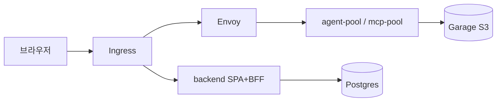


---


## 2. 사전 요구 사항


### 2.1 인프라


| 항목                 | 권장                              |
| ------------------ | ------------------------------- |
| Kubernetes         | 1.28+                           |
| Ingress Controller | nginx-ingress (매니페스트 기준)        |
| 스토리지               | PVC 지원 (Postgres 5Gi+)          |
| 레지스트리              | GHCR pull 가능 (`registry-creds`) |


### 2.2 운영 도구

- `kubectl`, `kustomize` (또는 `kubectl kustomize`)
- `gh` CLI (이미지 빌드·GHCR 인증 시)
- `make` (저장소 루트 Makefile)


### 2.3 외부 의존 (선택)

- **LLM API**: OpenAI·Anthropic 등 — [Platform env](#7-platform-env-llm-키-설정)에서 설정
- **path-graph 파이프라인**: 문서 수집·RAG·wiki VFS (Pipeline 메뉴)
- **모니터링**: OTLP endpoint (overlay별 ConfigMap)

---


## 3. 설치


### 3.1 컨테이너 이미지 준비

이미지는 GitHub Actions가 GHCR에 push합니다. 태그는 **git commit SHA**이며 `:latest`는 사용하지 않습니다.

```bash
# main에 push 후
make build-images
make build-images-wait
```

또는 release publish 시 자동 빌드 — [.cursor/rules/github-release.mdc](../.cursor/rules/github-release.mdc)

대상 8종: `backend`, `auth`, `deploy-api`, `ext-authz`, `agent-base`, `mcp-base`, `hermes-base`, `path-graph-rag-mcp`

### 3.2 GHCR pull secret

```bash
GITHUB_USER=<ghcr-owner> GITHUB_PAT=<read:packages> make registry-secret
```

`make k8s-apply-dev` 실행 시 `gh auth token`으로 자동 생성을 시도합니다.

### 3.3 JWT 키 (최초 1회)

```bash
make ensure-jwt-secret
```

기존 `jwt-keys` secret이 있으면 건너뜁니다.

### 3.4 초기 관리자 비밀번호 secret

backend 기동 시 `users` 테이블이 비어 있으면 **초기 admin 계정**을 생성합니다.

```bash
kubectl -n runtime create secret generic initial-admin-password \
  --from-literal=password='<강력한-임시-비밀번호>' \
  --dry-run=client -o yaml | kubectl apply -f -
```


| 항목        | 값                                            |
| --------- | -------------------------------------------- |
| 기본 사용자명   | `admin` (`INITIAL_ADMIN_USERNAME`)           |
| 기본 tenant | `dev`                                        |
| 첫 로그인 후   | **비밀번호 변경 강제** (`must_change_password=true`) |


> Secret은 파일 마운트로만 전달됩니다 (`INITIAL_ADMIN_PASSWORD_FILE`). Pod env에 평문을 넣지 마세요.


### 3.5 클러스터 배포

```bash
# dev overlay (replicas=1, HTTP Ingress)
make k8s-apply-dev

# DB 마이그레이션
make db-migrate-all

# Pod 재시작 (이미지 갱신 후)
make k8s-rollout-restart
```

**stage/prod**:

```bash
make k8s-apply-stage   # 또는 k8s-apply-prod
```


| overlay    | Ingress 호스트                                  | TLS           |
| ---------- | -------------------------------------------- | ------------- |
| dev        | `https://agents.k8s-test` (HTTP redirect 가능) | 자체 서명 인증서     |
| stage/prod | `https://agents.didim365.app`                | Let's Encrypt |


dev 환경은 `/etc/hosts`에 Ingress IP 매핑이 필요할 수 있습니다.

```text
<INGRESS_IP>  agents.k8s-test
```


### 3.6 배포 확인

```bash
kubectl -n runtime get pods
kubectl -n runtime get ingress
```

모든 Deployment가 `Running`이고 Ingress에 ADDRESS가 할당되면 설치 완료입니다.

### 3.7 외부 S3 사용 (선택)

기본 번들 저장소는 클러스터 내 **Garage**입니다. NCP·AWS S3로 교체:

```bash
# .s3-config.json 작성 후
S3_BUCKET=my-bucket make s3-secret
kubectl -n runtime rollout restart deployment/backend
```

---


## 4. 첫 로그인

브라우저에서 Ingress URL을 엽니다.

- dev: `https://agents.k8s-test/`

### 로그인 화면

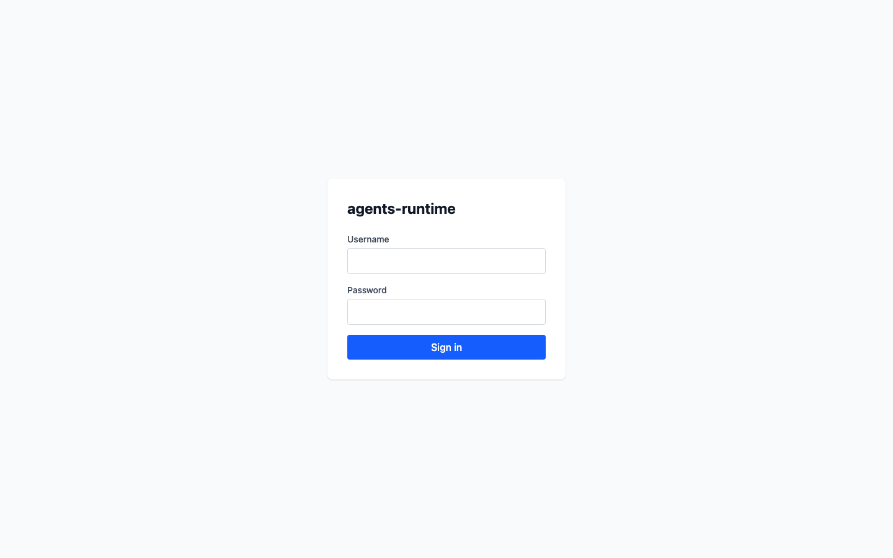

1. **Username**: `admin` (또는 설정한 `INITIAL_ADMIN_USERNAME`)
2. **Password**: `initial-admin-password` secret에 설정한 값
3. **Sign in** 클릭

로그인 성공 시 대시보드(`/`)로 이동합니다.

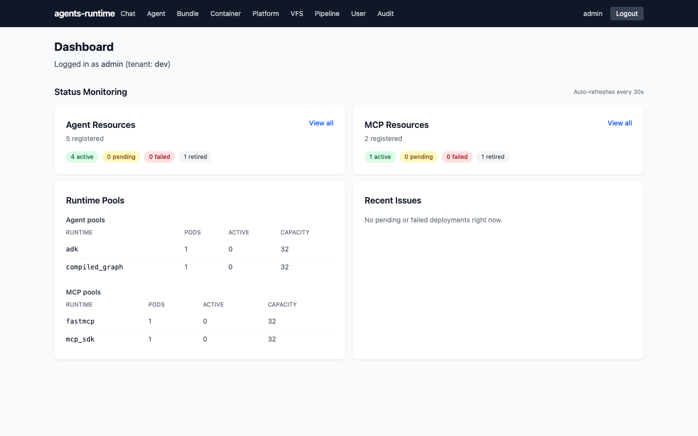

### 비밀번호 변경

초기 bootstrap 계정은 **My Profile** (`/me`)에서 비밀번호 변경이 강제될 수 있습니다. 이미 변경을 완료한 계정은 바로 관리 메뉴를 사용합니다.

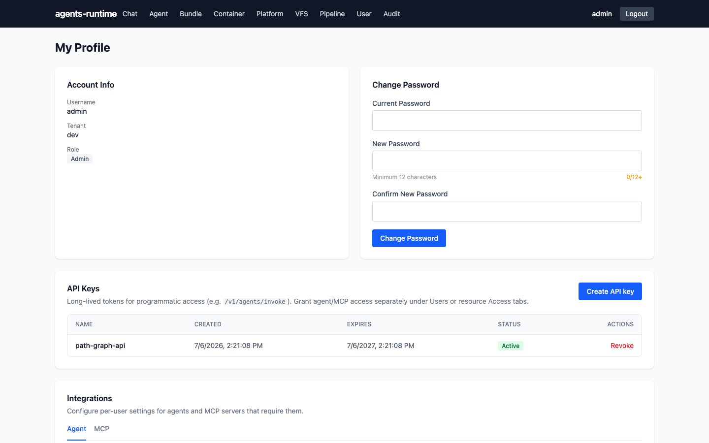

1. **Change Password** 섹션에서 새 비밀번호 입력 (최소 12자)
2. 저장 후 상단 네비게이션의 관리 메뉴 이용 가능

> 운영 환경에서는 초기 secret을 삭제하거나 비밀번호 변경 완료 후 secret을 교체하는 것을 권장합니다.

---


## 5. 화면 구성

로그인 후 상단 네비게이션에서 주요 메뉴에 접근합니다. (관리자 `is_admin=true` 기준)


| 메뉴         | URL                                              | 용도                         |
| ---------- | ------------------------------------------------ | -------------------------- |
| Agent      | `/agents`, `/bundle/agents`, `/container/agents` | General·Bundle·Image agent |
| MCP        | `/bundle/mcp`, `/container/mcp`                  | MCP 번들·이미지                 |
| Chat       | `/chat`                                          | 에이전트와 대화                   |
| Users      | `/users`                                         | 계정·권한                      |
| Pipeline   | `/pipeline`                                      | 문서 수집·RAG 프로젝트             |
| Platform   | `/settings/infra`, `/bundle/bucket`              | LLM env, 번들 저장소            |
| VFS        | `/vfs`                                           | 가상 파일 시스템 (Agent/User/Wiki) |
| My Profile | `/me`                                            | 비밀번호·API Key·Integrations  |

일반 사용자(`is_admin=false`)는 **My Profile**, **Integrations**, **Chat**만 사용할 수 있습니다.

### Platform (설정)

플랫폼 공통 LLM API 키, Opik URL, OTLP Endpoint 등을 설정하고 번들 버킷을 관리합니다. **Platform** → **Settings** 또는 **Bucket** 메뉴를 이용합니다.

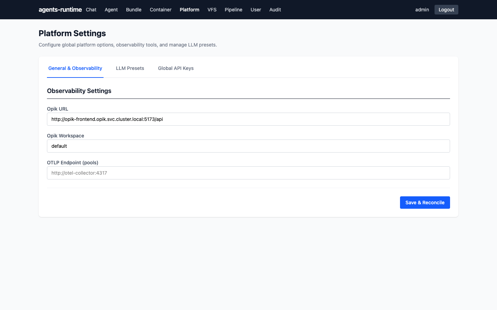

### VFS (가상 파일 시스템)

에이전트·사용자·Wiki 파일을 브라우저에서 직접 관리하고 편집할 수 있습니다. **VFS** 메뉴로 이동하여 탭별로 탐색합니다.

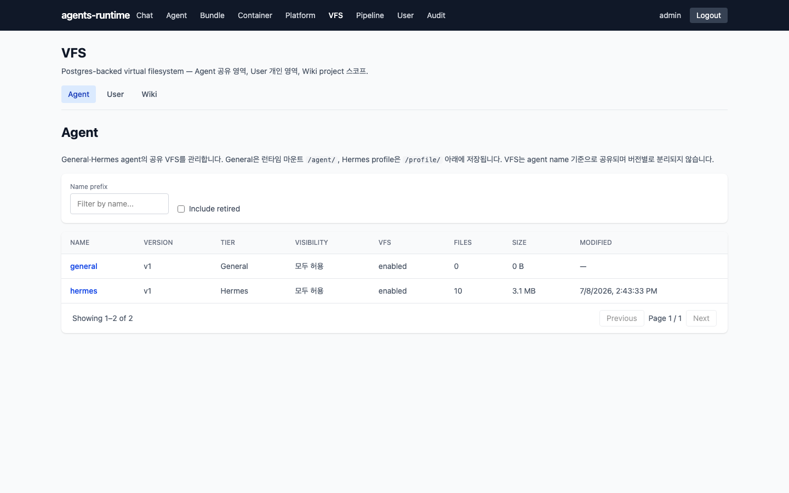

---

## 6. 에이전트 등록·사용

### 6.1 General Agent (권장 시작점)

코드 zip 없이 UI에서 설정만으로 agent를 만듭니다.

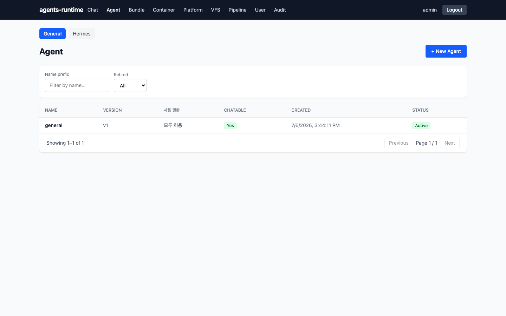

1. **Agent** → **General** 탭 → **+ New Agent**
2. 필수 입력:
  - `name`, `version`
  - **사용 권한** (`visibility`: private / tenant / public / allowlist)
  - `system_prompt`
  - MCP 서버(체크박스), Pipeline project(지식 연동 시)
3. **Create** → 목록에 표시


### 6.2 Bundle Agent (zip 업로드)

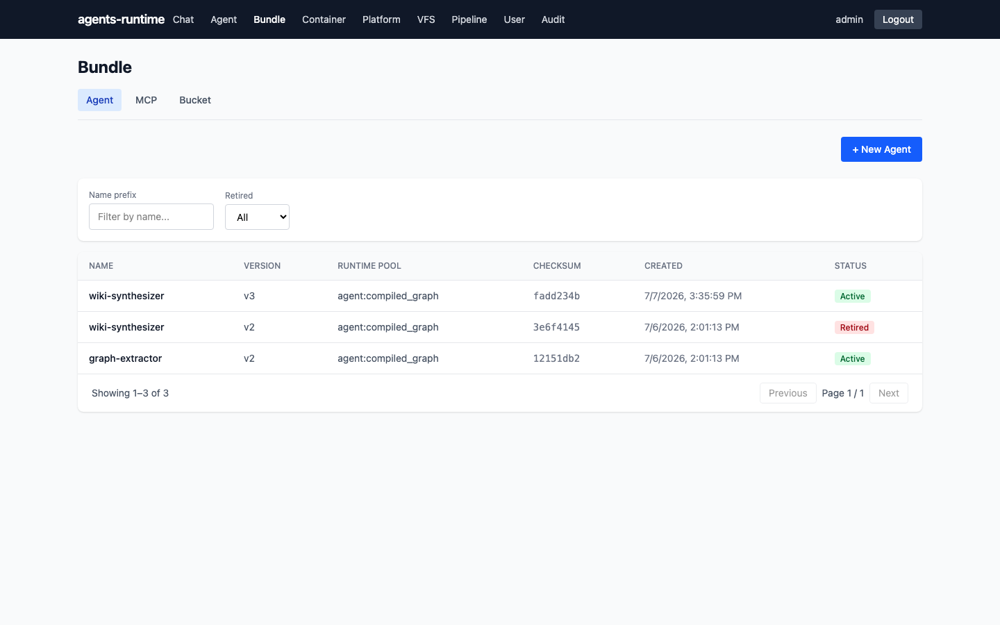

1. **Agent** → **Bundle** 탭 → **+ New Agent**
2. **zip 업로드** 또는 **외부 URI** 탭 선택
3. 공통 필드:
  - `name`, `version`, `runtime_pool` (예: `agent:compiled_graph`)
  - `entrypoint`: `module.path:factory`
  - `config` JSON (선택)
4. 등록 후 상세 페이지에서 **Access** 탭으로 사용자 권한 부여

번들 작성·배포 절차: [deploy/examples/mcp-base/README.md](../deploy/examples/mcp-base/README.md)

### 6.3 MCP 서버 등록

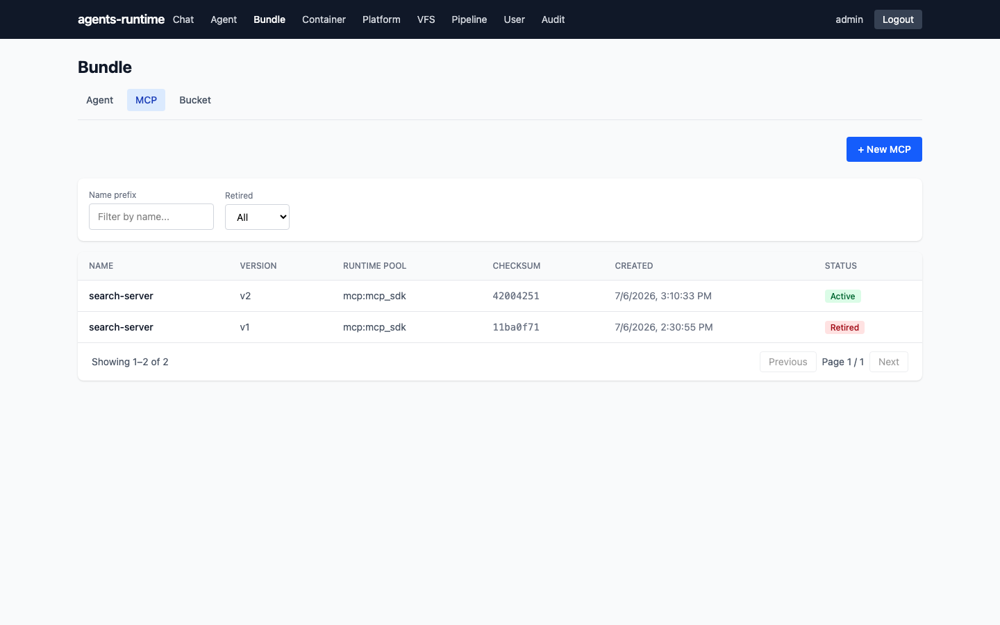

1. **MCP** → **Bundle** → **+ New MCP**
2. `runtime_pool`: `mcp:fastmcp` 또는 `mcp:mcp_sdk`
3. Pipeline 연동 MCP는 **Pipeline project binding 필요** 체크


### 6.4 사용자 권한 (Access)

`visibility=allowlist`인 리소스는 명시적 grant가 필요합니다. **admin도 자동 면제되지 않습니다.**

1. Agent/MCP **상세** → **Access** 탭
2. 사용자 검색 → **Grant**
3. 또는 **Users** → 사용자 상세 → 리소스별 grant


### 6.5 Chat에서 대화

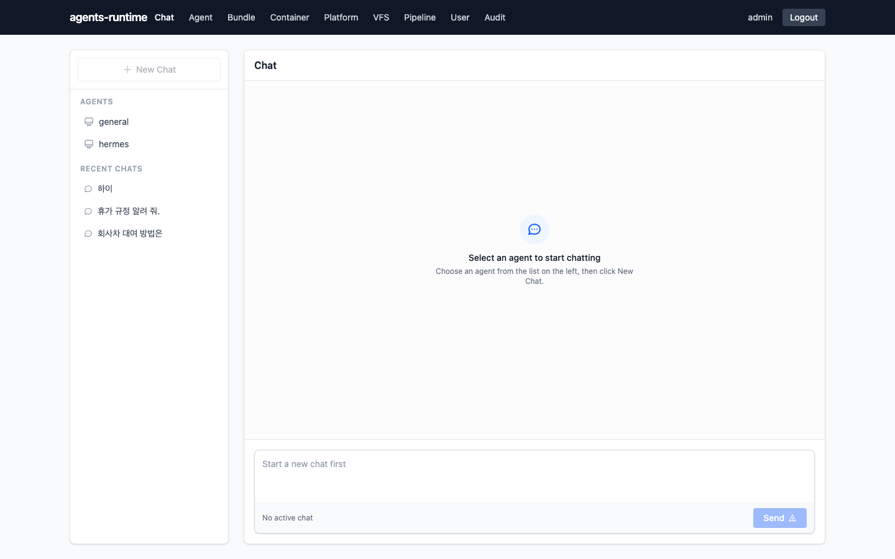

1. **Chat** 메뉴 이동
2. 왼쪽에서 에이전트 선택 (`chat_selectable=true`이고 ACL 통과한 agent만 표시)
3. 메시지 입력 → SSE 스트리밍 응답
4. 대화 스레드는 서버에 저장되며, New Chat 시 agent **version이 pin**됩니다

---


## 7. Platform env (LLM 키 설정)

에이전트가 LLM을 호출하려면 플랫폼 공통 API 키가 pool Pod에 주입되어야 합니다.

1. **Platform** → **Settings** → `/settings/infra`
2. OpenAI / Anthropic / 기본 모델 등 입력
3. 저장 시 backend reconciler가 `runtime-infra` ConfigMap·Secret을 갱신하고 pool을 rollout


| 설정 위치                | 용도                               |
| -------------------- | -------------------------------- |
| `infra_meta`         | 플랫폼 LLM API key, Opik URL, OTLP  |
| `source_meta.config` | 번들별 credential (예: Naver Search) |
| `user_meta`          | 사용자별 OAuth·메일함 등                 |


e2e 예시: [deploy/examples/tests/e2e/README.md](../deploy/examples/tests/e2e/README.md) Step 2 (`PUT /api/infra-meta`)

---


## 8. Pipeline (문서·RAG)

path-graph 기반 지식 파이프라인입니다.

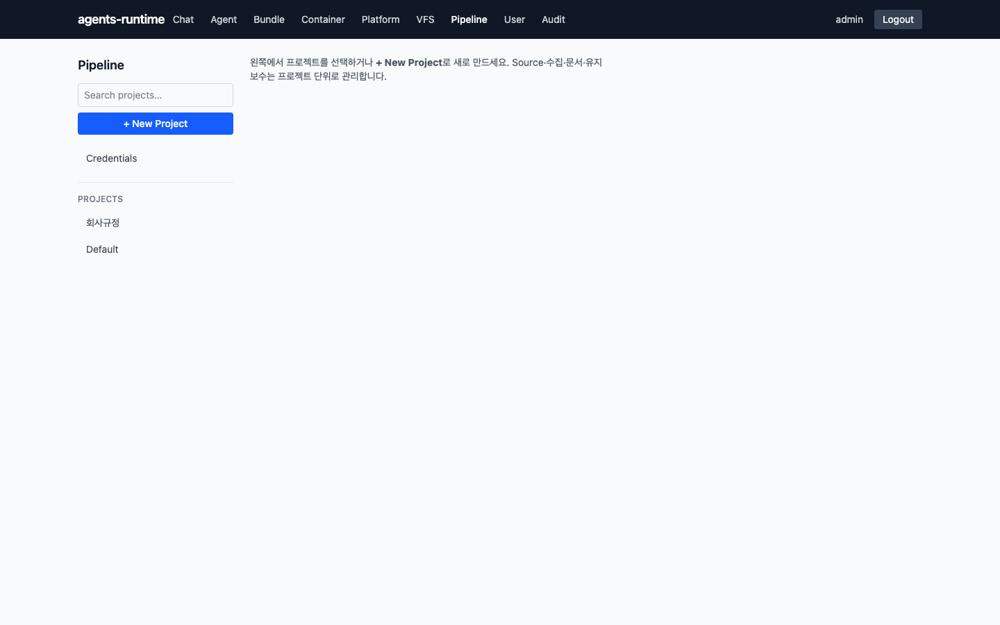

1. **Pipeline** → 프로젝트 생성
2. **Sources**: SharePoint·Git 등 수집 소스 등록
3. **Runs**: ingest 워크플로 실행·상태 확인
4. **Documents**: 인덱싱된 문서 조회
5. General agent의 `knowledge_project_ids`에 프로젝트를 연결하면 Chat 시 wiki VFS·retrieval 사용

OAuth credential: **Pipeline** → **Credentials**

---


## 9. 사용자 관리

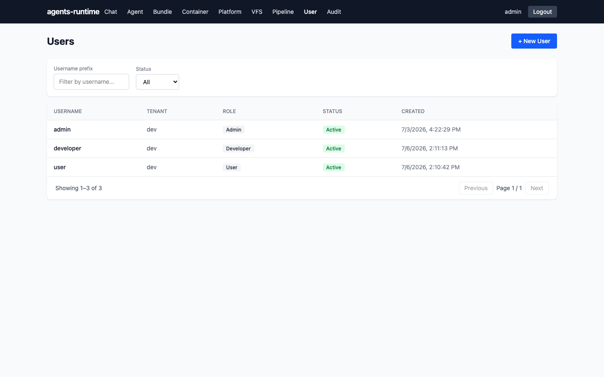

1. **Users** → **+ 사용자 추가**
2. `username`, `tenant`, `is_admin`, 초기 비밀번호 설정
3. 비밀번호 리셋·비활성화·삭제는 사용자 상세에서 수행
4. **마지막 admin**은 삭제·강등할 수 없습니다 (self-lockout 방지)

---


## 10. API Key (장기 invoke)

path-graph 등 외부 자동화용. **My Profile** (`/me`) 화면 하단 **API Keys** 섹션에서 발급합니다.


1. **My Profile** (`/me`) → **API Keys**
2. 이름 입력 후 발급 — plain key(`ak_…`)는 **생성 시 1회만** 표시
3. agent/MCP `user_resource_access`는 별도 grant 필요

---


## 11. 운영 명령 치트시트

```bash
# 이미지 빌드 대기 후 배포
make k8s-redeploy-dev

# 특정 SHA로 배포
IMAGE_TAG=<git-sha> make k8s-apply-dev

# DB 마이그레이션
make db-migrate-all

# 전체 rollout
make k8s-rollout-restart

# e2e 스모크 (dev 클러스터)
export ADMIN_PASSWORD='<admin 비밀번호>'
export OPENAI_API_KEY='sk-...'
./deploy/examples/tests/e2e/run.sh
```

---


## 12. 트러블슈팅


| 증상               | 확인                                                         |
| ---------------- | ---------------------------------------------------------- |
| ImagePullBackOff | `registry-creds` secret, GHCR 태그(`IMAGE_TAG`) 일치           |
| 로그인 401          | `initial-admin-password` secret, backend 로그의 bootstrap 메시지 |
| invoke 401       | Chat 전 `GET /api/auth/access-token`, Bearer 헤더             |
| invoke 403       | `user_resource_access` grant, `visibility` 정책              |
| invoke 5xx (LLM) | `/settings/infra`에 API key, pool pod env                   |
| 번들 409           | 동일 `(kind, name, version)` 존재 — version bump 또는 retire     |
| Chat 에이전트 없음     | `chat_selectable`, ACL, `retired=false`                    |


로그 확인:

```bash
kubectl -n runtime logs deploy/backend -f
kubectl -n runtime logs deploy/agent-pool-compiled-graph -f
kubectl -n runtime logs deploy/envoy -f
```

로컬 디버깅: [telepresence_debug_guide.md](./telepresence_debug_guide.md), `./scripts/wire-dev.sh`

---


## 13. 관련 문서

- [개발가이드.md](./개발가이드.md) — 아키텍처·개발 환경
- [deploy/DESIGN.md](../deploy/DESIGN.md) — K8s·Envoy·NetworkPolicy
- [frontend/DESIGN.md](../frontend/DESIGN.md) — UI 라우트·화면별 API
- [bundles/README.md](../bundles/README.md) — 운영 번들
- [deploy/examples/tests/e2e/README.md](../deploy/examples/tests/e2e/README.md) — 통합 검증

